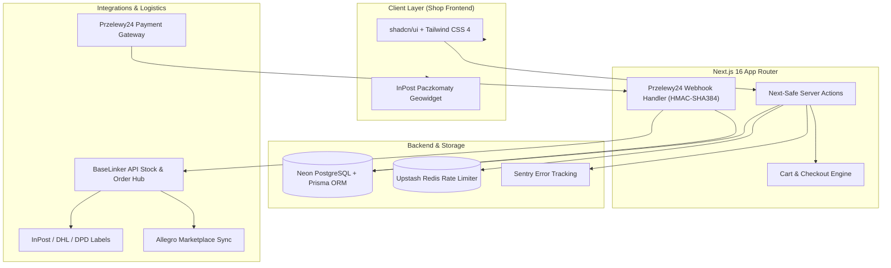

# Well Botany — E-Commerce Platform

[](https://github.com/danylo-morhun/zielarnia/actions/workflows/ci.yml)
[](https://nextjs.org/)
[](https://react.dev/)
[](https://www.prisma.io/)
[](https://www.przelewy24.pl/)
[](https://baselinker.com/)
[](https://biomejs.dev/)
[](https://www.typescriptlang.org/)

A production e-commerce platform specializing in bio-products, dietary supplements, and health items. Built with **Next.js 16 (React 19)**, **Prisma ORM**, **Neon Serverless PostgreSQL**, **Przelewy24 Gateway**, and a **BaseLinker Integration Hub**.

---

## System Architecture



---

## Key Engineering & Security Specs

### 1. Financial Webhook Integrity & Timing-Safe Security
- **HMAC-SHA384 Verification**: Przelewy24 payment webhooks are verified using cryptographic SHA-384 signature hashes.
- **Timing-Safe Comparison**: Webhook signature verification uses constant-time byte comparisons to eliminate side-channel timing attacks.
- **Idempotent Order Transitions**: State transitions from `PENDING` to `PAID` are wrapped in atomic database transactions, preventing double-processing on network retries.

### 2. Multi-Channel Logistics & Stock Sync (BaseLinker Hub)
- **Real-Time Stock Sync**: Inventory levels are synced bi-directionally between PostgreSQL, BaseLinker, and marketplace channels (Allegro).
- **Automated Parcel Labels**: Direct integration with InPost Paczkomaty Geowidget generates shipping labels automatically upon order payment completion.

### 3. Health & Regulatory Compliance (GIS / Sanepid)
- Dedicated database modeling for dietary supplement labeling, active ingredients, dosage warnings, and Sanepid/GIS regulatory health claim compliance.
- Strict XSS protection using `sanitize-html` for product descriptions and rich-text specifications.

---

## Technical Decisions & Trade-Offs

| Engineering Choice | Alternative Considered | Rationale & Architectural Trade-off |
| :--- | :--- | :--- |
| **Prisma ORM + Neon** | Drizzle / TypeORM | Selected Prisma for strong type generation across complex e-commerce relational schemas (Orders, Variants, Coupons, Customers, Audit Logs). |
| **Next-Safe-Action** | Native `useActionState` | Provides type-safe server action inputs/outputs with built-in Zod schema validation and global error handling. |
| **Upstash Redis** | Self-hosted Redis | Serverless rate limiting (`@upstash/ratelimit`) on checkout endpoints and API routes without managing infrastructure. |
| **Ephemeral Neon Branches in CI** | Shared Staging DB | GitHub Actions dynamically provisions an isolated Neon Postgres branch per CI run to test migrations and E2E checkout flows safely without race conditions. |

---

## Testing & Quality Assurance

- **Unit Tests (Vitest)**: Tests financial calculations, Przelewy24 HMAC signatures, timing-safe string comparison, and supplier product import parsers.
- **Integration & E2E (Playwright)**: End-to-end tests for product filtering, cart management, coupon redemption, and checkout flows.
- **Ephemeral Database Testing**: CI spins up isolated Neon Postgres branches automatically for every PR run.

### Running Tests Locally

```bash
# Run Unit Tests
pnpm exec vitest run tests/unit

# Run Typecheck & Biome Linter
pnpm tsc --noEmit
pnpm lint
```

---

## Local Setup

### 1. Clone & Install
```bash
git clone git@github.com:danylo-morhun/zielarnia.git
cd zielarnia
pnpm install
```

### 2. Database Migration & Development Server
```bash
# Generate Prisma Client & Run Migrations
pnpm db:generate
pnpm db:migrate

# Start Next.js dev server
pnpm dev
```
Open [http://localhost:3000](http://localhost:3000) in your browser.

---

## License

MIT © Danylo Morhun
